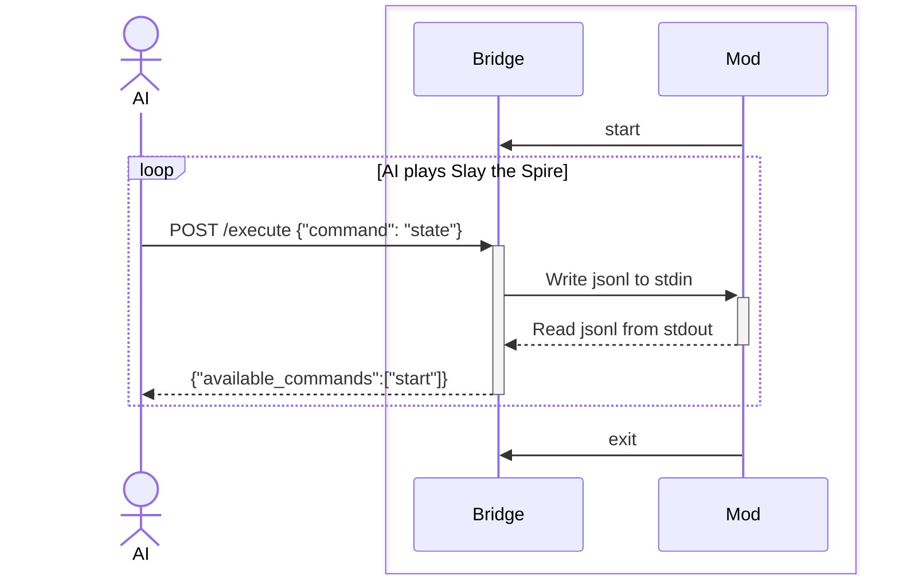
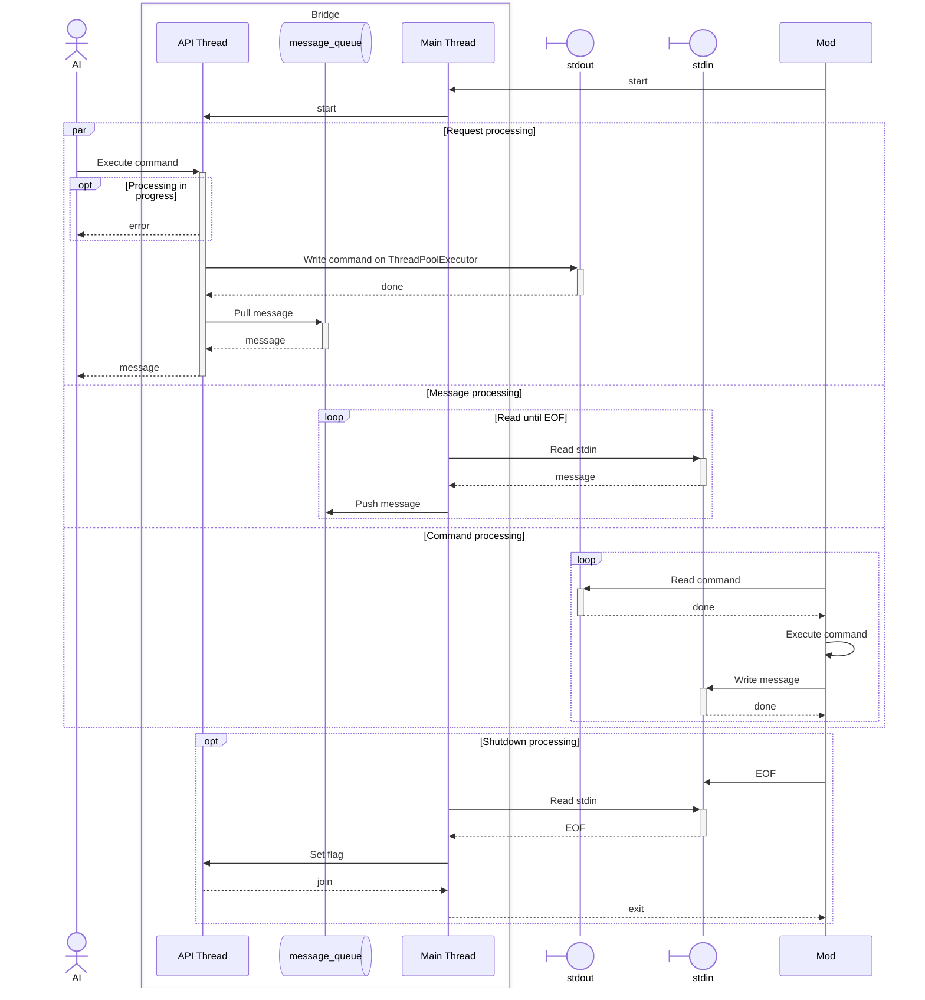

# AI plays Slay the Spire

## 시스템 설계

시스템은 크게 3가지 컴포넌트로 구성됩니다.
AI, Bridge, Mod입니다.

AI는 게임을 플레이하는 AI 에이전트입니다.
내부적으로 OpenAI의 Codex CLI를 사용합니다.

Bridge는 AI가 명령을 호출하고 메시지를 받을 수 있도록 하는 중계자입니다.
Bridge는 AI로부터 HTTP 요청을 받고 Mod와 표준 입출력으로 통신합니다.
Slay the Spire를 Play with Mods로 실행하면 Mod가 Bridge를 실행합니다.

Mod([CommunicationMod](https://github.com/ForgottenArbiter/CommunicationMod))는 제 3자 프로그램입니다. Slay the Spire의 Mod로 표준 IO로 게임을 제어할 수 있게 해줍니다.

### AI와 Bridge를 분리한 이유

AI와 Bridge를 분리한 이유는 Mod가 프로그램을 실행하는 구조 때문입니다.

AI 에이전트 프로그램을 Mod가 실행할 경우, 코드 수정시마다 게임을 재시작해야 합니다.

또한 프로그램은 Mod와 표준 입출력을 사용해서 통신해야 합니다.
따라서 일반적인 표준 출력을 사용한 로깅을 사용할 수 없고, 로깅이 필요한 경우 파일 로깅을 해야합니다.

위와 같은 이유로 Bridge는 변경이 거의 필요하지 않도록 단순한 중계 기능만 담당합니다.
이렇게 구성하면 AI 에이전트 프로그램은 표준 출력을 사용해 로깅할 수 있고, 사소한 AI 에이전트 코드 수정을 위해서 게임을 재시작할 필요도 없기 때문입니다.

#### 전체 시퀀스 다이어그램



### Bridge

Bridge는 AI 에이전트의 명령을 HTTP로 받고, 표준 입출력 jsonl 프로토콜을 사용해 Mod로 전달합니다.
총 2개 이상의 스레드를 사용합니다.
메인 스레드와 API 스레드 그리고 내부적으로 비동기 이벤트 루프를 블로킹하지 않기 위한 ThreadPoolExecutor를 사용합니다.

메인 스레드는 Mod에 의해 실행되는 스레드입니다.
Mod는 프로세스 종료 신호로 표준 입력 EOF를 사용합니다.
메인 스레드에서 종료 처리와 표준 입력 블로킹 처리를 담당합니다.

API 스레드는 FastAPI 기반 비동기 이벤트 루프 스레드입니다.
비동기 요청을 처리해야하기 때문에 표준 입출력 블로킹 API를 이 스레드에서 호출하지 않습니다.
메인 스레드에서 표준 입력 블로킹 API로 읽은 메시지를 비동기 큐에 넣고 API 스레드에서 꺼냅니다.
표준 출력 블로킹 API도 ThreadPoolExecutor로 실행을 위임합니다.
또한 중복 HTTP 요청 처리시 명령이 꼬일 수 있기 때문에, 중복 요청을 허용하지 않도록 잠금을 사용합니다.

#### Bridge 상세 시퀀스 다이어그램



## 요구사항

### 모드 설치

아래 모드들을 설치합니다:

- [ModTheSpire](https://steamcommunity.com/sharedfiles/filedetails/?id=1605060445)
- [BaseMod](https://steamcommunity.com/sharedfiles/filedetails/?id=1605833019)
- [Communication Mod](https://steamcommunity.com/sharedfiles/filedetails/?id=2131373661)

### 설정 구성

> macOS 환경 기준입니다.

설정 파일 경로는 `~/Library/Preferences/ModTheSpire/CommunicationMod/config.properties`입니다.

다음 예제와 같이 작성합니다:

```sh
command=/your/absolute/path/ai-plays-slay-the-spire/scripts/bridge.sh
runAtGameStart=true
```

`command`는 각 환경에 맞는 절대경로를 입력합니다.
