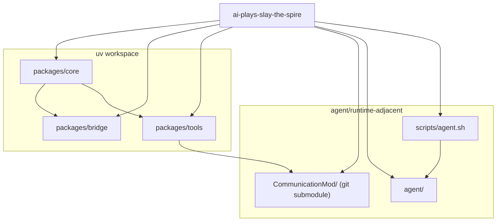
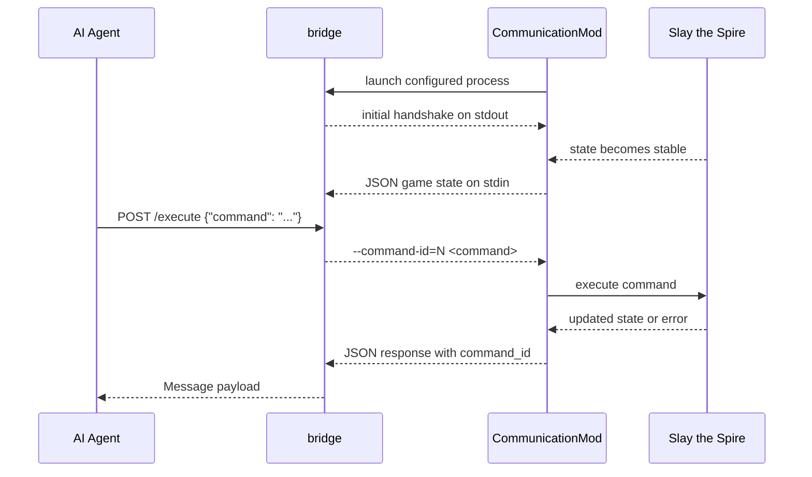

# AI Plays Slay the Spire

This repository is an experimental local runtime for letting an AI agent play Slay the Spire through [CommunicationMod](./CommunicationMod). It is organized as a `uv` workspace monorepo with three Python packages, one Java git submodule, and a separate agent prompt directory.

## Overview

- `packages/core`: shared paths and logging primitives used across the workspace
- `packages/bridge`: the runtime process launched by CommunicationMod; it speaks the stdin/stdout game protocol, exposes a small HTTP API, and persists a local event journal
- `packages/tools`: developer CLIs for bootstrapping submodules and building/installing the Java mod
- `CommunicationMod/`: Java mod checked out as a git submodule; it owns the actual integration with Slay the Spire
- `agent/`: Codex-facing instructions for the gameplay agent
- `scripts/agent.sh`: helper script that launches the Codex TUI in `agent/` with repo-scoped `CODEX_HOME`

## Repository Layout

```text
.
|-- agent/                  # Prompt and behavior instructions for the game-playing agent
|-- CommunicationMod/       # Java mod submodule
|-- packages/
|   |-- bridge/             # FastAPI + protocol bridge + SQLite event journal
|   |-- core/               # Shared filesystem paths and logging setup
|   `-- tools/              # bootstrap/build-mod CLIs
|-- scripts/
|   `-- agent.sh            # Starts Codex in ./agent with ./.work/codex
|-- .work/                  # Local runtime artifacts, logs, DB, build outputs
|-- pyproject.toml          # Workspace root
`-- uv.lock
```

## Workspace Architecture

### Package Responsibilities

| Component | Depends on | Role |
| --- | --- | --- |
| `core` | none | Defines canonical filesystem locations in [`core.paths`](./packages/core/src/core/paths.py) and shared structured logging in [`core.log`](./packages/core/src/core/log.py). |
| `bridge` | `core`, FastAPI, SQLAlchemy, aiosqlite | Runs as the external child process for CommunicationMod. Reads game messages from stdin, writes commands to stdout, exposes `/execute` and `/events`, and stores command/message history in SQLite. |
| `tools` | `core`, Typer | Provides `uv run bootstrap` and `uv run build-mod` for initializing the submodule and building/installing the Java mod into the local Slay the Spire mods directory. |
| `CommunicationMod` | Slay the Spire, ModTheSpire, BaseMod | Injects into the game, launches the Python bridge process, converts game state to JSON, and executes commands coming back from the bridge. |
| `agent` | CommunicationMod protocol knowledge | Stores the prompt used for the Codex gameplay session. It is not a Python package and does not participate in the `uv` workspace dependency graph. |

### Dependency Graph



## Runtime Flow

The runtime path is intentionally small:

1. `CommunicationMod` starts the Python bridge process configured in its `config.properties`.
2. `bridge` starts a background stdin reader, initializes SQLite, starts FastAPI, and emits its initial handshake through stdout.
3. When the game reaches a stable state, `CommunicationMod` sends a JSON message to the bridge.
4. The AI agent sends a command to the bridge over HTTP.
5. `bridge` allocates a command id, writes `--command-id=<id> <command>` to stdout, and records the command as an event.
6. `CommunicationMod` executes the command in game and later emits a JSON response or error containing the same `command_id`.
7. `bridge` matches the response to the pending request, returns it to the caller, and records the incoming message as an event.

`agent/` is the repository's prompt layer for that AI agent; the bridge itself stays narrow and protocol-focused.

### Sequence Diagram



### Bridge Internals

Within `packages/bridge`, responsibilities are split by layer:

- API layer: [`bridge.api`](./packages/bridge/src/bridge/api.py) exposes `POST /execute` and `GET /events`
- Composition root: [`bridge.container`](./packages/bridge/src/bridge/container.py) wires DB, services, and background workers
- Command path: `ExecutionService -> CommandWriter -> stdout -> CommunicationMod`
- Message path: `stdin -> message_thread -> MessageService -> ExecutionService/EventService`
- Persistence: [`bridge.db`](./packages/bridge/src/bridge/db.py), [`bridge.models`](./packages/bridge/src/bridge/models.py), and repository classes persist command/message events plus the monotonic command id counter

## Git Submodule

`CommunicationMod/` is tracked as a git submodule:

- path: `CommunicationMod`
- upstream: `https://github.com/harryplusplus/CommunicationMod.git`
- branch: `master`

`uv run bootstrap` runs:

- `git submodule sync --recursive`
- `git submodule update --init --recursive`

`uv run build-mod` then builds the Java mod with Maven and symlinks the resulting jar into the local Slay the Spire mods directory.

## Local Environment

This project is currently optimized for a local macOS setup rather than cross-platform portability.

- macOS: `26.3.1`
- [Slay the Spire - Steam](https://store.steampowered.com/app/646570/Slay_the_Spire/)
- [ModTheSpire - Steam](https://steamcommunity.com/sharedfiles/filedetails/?id=1605060445)
- [BaseMod - Steam](https://steamcommunity.com/sharedfiles/filedetails/?id=1605833019)
- [uv](https://docs.astral.sh/uv/): `0.10.9`
- Python: `3.11`
- [SDKMAN!](https://sdkman.io/)
- [Maven](https://maven.apache.org/)
- JDK: `8.0.482-zulu`

Some important runtime paths are hard-coded in [`core.paths`](./packages/core/src/core/paths.py), including the Steam workshop jars, the Java installation, and local working directories under `./.work`.

## Setup

```sh
uv sync --all-packages --locked
uv run bootstrap
uv run build-mod
```

What each step does:

- `uv sync --all-packages --locked`: installs the workspace and all package dependencies
- `uv run bootstrap`: initializes and updates the `CommunicationMod` submodule
- `uv run build-mod`: builds `CommunicationMod.jar` and links it into the game's mods directory

## CommunicationMod Configuration

CommunicationMod config file location:

```text
~/Library/Preferences/ModTheSpire/CommunicationMod/config.properties
```

Use a configuration like this:

```properties
command=/absolute/project/.venv/bin/python -m bridge
runAtGameStart=true
```

Notes:

- `command` must be an absolute path that matches your local environment
- `python -m bridge` launches the workspace package defined in `packages/bridge`
- `runAtGameStart=true` makes CommunicationMod spawn the bridge automatically when the game starts

## Operational Files

These are the files and directories you will usually want to inspect first while debugging:

| Path | Purpose |
| --- | --- |
| `./.work/db.sqlite` | SQLite database used by the bridge for events and command ids |
| `./.work/logs/bridge.log` | rotating bridge runtime log |
| `./.work/CommunicationMod.jar` | local build output produced by `uv run build-mod` |
| `./agent/AGENTS.md` | gameplay instructions for the Codex agent |
| `./scripts/agent.sh` | launches the Codex TUI in `./agent` with `CODEX_HOME=./.work/codex` |

## Running the Agent Shell

If you want to launch the Codex TUI scoped to this repository's gameplay prompt and local state directory:

```sh
scripts/agent.sh
```

That script changes into `./agent` and uses `./.work/codex` as `CODEX_HOME`, so the gameplay session keeps its own local state inside the repository.
