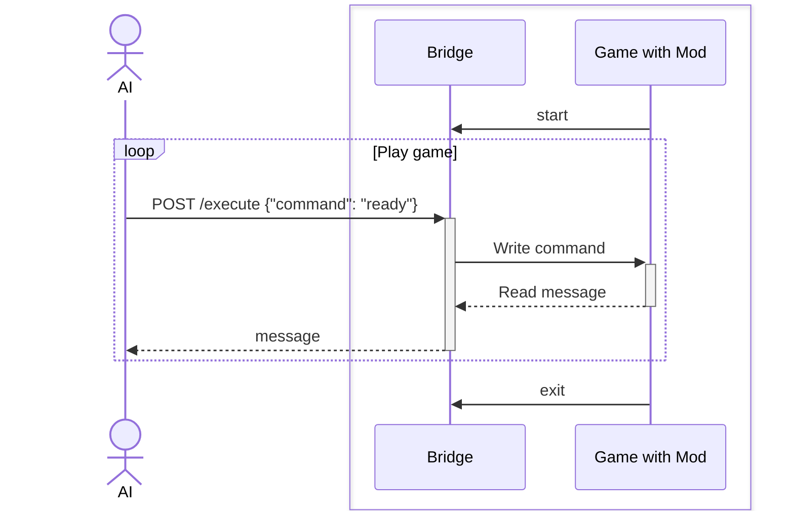
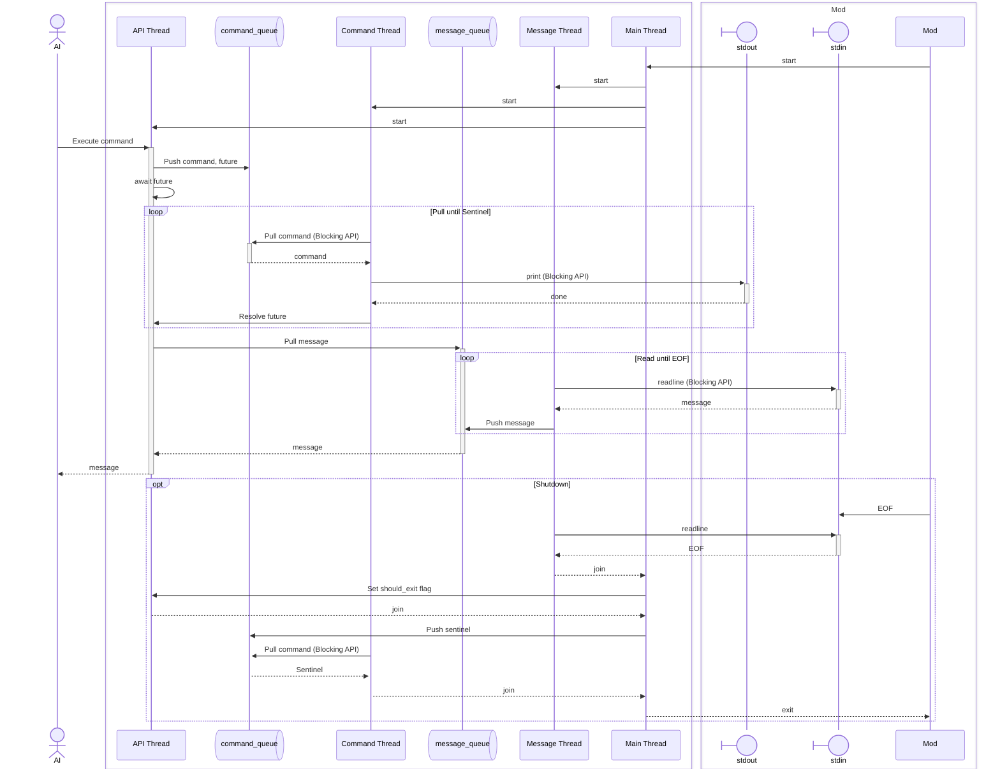

AI plays Slay the Spire

## 요구사항

### 모드 설치

아래 모드들을 설치합니다:

- [ModTheSpire](https://steamcommunity.com/sharedfiles/filedetails/?id=1605060445)
- [BaseMod](https://steamcommunity.com/sharedfiles/filedetails/?id=1605833019)
- [Communication Mod](https://steamcommunity.com/sharedfiles/filedetails/?id=2131373661)

### 설정 구성

> macOS 환경 기준입니다.

설정 파일 경로는 `~/Library/Preferences/ModTheSpire/CommunicationMod/config.properties`입니다.

다음 예제와 같이 작성합니다:

```sh
command=/your/absolute/path/ai-plays-slay-the-spire/scripts/bridge.sh
runAtGameStart=true
```

`command`는 각 환경에 맞는 절대경로를 입력합니다.

## 시스템 설계

크게 AI, Bridge, Mod로 구성됩니다.
AI는 게임을 플레이하는 AI 에이전트입니다.
Bridge는 AI가 HTTP API로 명령을 호출하고 메시지를 받을 수 있도록 하는 프로그램입니다.
*Play with Mods*로 게임을 실행하면 Mod가 Bridge를 실행합니다.

> `config.properties`의 `command`가 Bridge 실행 명령어입니다.

AI와 Bridge 프로그램을 분리한 이유는 Mod가 프로그램을 실행시켜주는 구조 때문입니다. 쉽게 AI 에이전트 프로그램의 코드 수정 및 디버깅을 하기 위해서입니다.

AI 에이전트 프로그램을 Mod가 실행할 경우 코드를 수정시 게임을 재시작해야 합니다.
프로그램 실행 주체를 Mod가 갖고 있기 때문입니다.
AI 에이전트 코드 수정마다 게임을 재시작해야하는 것은 개발을 어렵게 만듭니다.

또한 Mod와 통신은 stdin, stdout을 사용해야 합니다.
따라서 stdout을 사용한 로깅을 할 수 없습니다.
Mod가 실행해주기 때문에 로깅이 필요한 경우 파일 로깅을 해야합니다.
이는 AI 에이전트 코드 디버깅을 불편하게 만듭니다.



### Bridge

Bridge는 AI 에이전트의 HTTP API 요청을 처리합니다.
Mod와 stdin, stdout으로 jsonl 프로토콜을 사용해 통신합니다.
총 4개의 스레드를 사용합니다.

Main 스레드는 Mod에 의해 구동되는 스레드입니다.

Message 스레드는 stdin으로부터 메시지를 읽는 스레드입니다.
jsonl 프로토콜을 사용하기 때문에 `readline` Blocking API를 사용합니다.
읽기가 여러 곳에서 중복으로 호출되지 않도록 읽기를 전담합니다.

Command 스레드는 stdout으로 명령을 쓰는 스레드입니다.
마찬가지로 jsonl 프로토콜을 사용하며 쓰기가 중복되지 않도록 쓰기를 전담합니다.

API 스레드는 `FastAPI` 기반 이벤트 루프 스레드입니다.
Mod와 통신을 stdin, stdout으로 하기 때문에 읽기 및 쓰기가 꼬이지 않도록 중복 HTTP 요청을 허용하지 않습니다.


