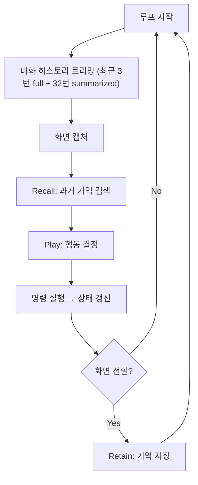

# AI Plays Slay the Spire

> 이 문서는 AI가 Harry의 지시에 따라 작성합니다.

**Harry**와 AI 코딩 에이전트가 함께 만드는 Slay the Spire 자동 플레이 봇입니다.
목표는 승천 0 심장 클리어. 하지만 과정에서 배우는 것이 더 중요합니다.

## 무엇이 특별한가

대부분의 게임 봇은 "이 판을 이기는 것"만 목표로 합니다. 이 프로젝트는 **Hindsight 장기기억**으로 각 런의 전략적 교훈을 축적하고, 다음 런에서 회상해 활용합니다. 외부 메모리 뱅크에 기억을 쌓고 검색하는 구조입니다.

단순한 게임 에이전트가 아니라, **"경험으로부터 학습하는 LLM 에이전트"**를 만드는 실험입니다.

## 협업 방식

Harry는 코드를 직접 쓰지 않습니다. AI 에이전트(Pi)와 협업합니다.

| Harry | AI 에이전트 |
|-------|------------|
| 방향 설정, 전략적 제안 | 코드 작성, 리팩토링 |
| 피드백, 질문, 검증 | 로그 분석, 데이터 조사 |
| 크리티컬한 제어 결정 | 세션 실행, 모니터링 |

### 협업에서 배운 것

- **AI는 통찰력을 발휘해야 합니다.** 시키는 대로만 하지 말고, 데이터에서 스스로 패턴을 발견해야 합니다.
- **문서화는 사고 구조를 바꿉니다.** AGENTS.md에 상태, 발견, 가설을 기록하면서 체계적으로 접근하게 되었습니다.
- **Hindsight 관찰은 durable pattern입니다.** 순간적인 HP/에너지 변화를 쌓으면 노이즈만 생깁니다. 의미 있는 기억은 "어떤 선택을 했고, 왜 그랬고, 다음에 어떻게 할 것인가"입니다.

## 현재 상태

### 인프라
- LLM: OpenAI 호환 API
- 장기기억: Hindsight `sts-v2` 뱅크 (921 memory units, Python SDK)
- 로깅: JSONL (ai.jsonl, game.jsonl, reasoning.jsonl, llm.jsonl, run.jsonl, proxy.jsonl, bridge.jsonl)
- **클래스 고정**: 시스템 프롬프트에서 DEFECT 전용 플레이 강제. 다른 클래스로 시작 불가.

### 발견하고 해결한 문제들
- **recall 쿼리 formulation** — keyword-style 쿼리는 enemy-specific memory를 잘 못 건짐. RecallAgent가 자연어 쿼리를 생성하면서 개선.
- **retain 품질** — 93%가 전투 play-by-play. RetainAgent가 이벤트, 상점, 캠프파이어 등 모든 주요 결정을 커버.
- **state 필터링** — `NOISE_KEYS`가 deck, relics, potions, map을 state에서 제거. 완전히 폐기하여 모든 정보를 state에 포함.
- **MAX_OUTPUT truncation** — `game_cli()`의 20K 제한이 recall JSON을 깨뜨림. 제거하고 recall 자체의 `max_tokens=2048`로 응답 크기 제한.
- **시스템 프롬프트 분리** — 단일 시스템 프롬프트를 에이전트별로 분리. messages는 순수 대화 히스토리만 보관.
- **타입 안전성** — `cast`, `Any`, `type: ignore` 최소화. `isinstance`로 타입 좁히기, `ParsedResponse` 도입.
- **스크린샷 비전 지원** — kimi-k2.6-precision이 vision을 지원하여 세 에이전트(Recall/Play/Retain) 모두 현재 화면 스크린샷을 받음. 이미지는 `messages`에 축적되지 않고 루프당 ephemeral하게 주입.

## 아키텍처

### Recall/Retain 흐름


```mermaid
flowchart TD
    A["루프 시작"] --> B["대화 히스토리 트리밍 (최근 3턴 full + 32턴 summarized)"]
    B --> C["화면 캡처"]
    C --> D["Recall: 과거 기억 검색"]
    D --> E["Play: 행동 결정"]
    E --> F["명령 실행 → 상태 갱신"]
    F --> G{"화면 전환?"}
    G -->|"Yes"| H["Retain: 기억 저장"]
    G -->|"No"| A
    H --> A
```

- **Recall**: RecallAgent가 LLM으로 자연어 쿼리를 생성 → `game CLI` → Hindsight SDK(`sts-v2`, types=world/experience/observation, max_tokens=2048). tool 미사용 시 최대 5회 재시도.
- **Retain**: screen 전환 감지 시 RetainAgent가 전략적 요약을 생성 → `game CLI` → Hindsight SDK(async, context=전투/빌드 교훈). `document_id=combat-{seed}-{act}-{floor}`로 전투별 그룹핑.

### 에이전트별 구성

| | RecallAgent | PlayAgent | RetainAgent |
|---|---|---|---|
| **시스템 프롬프트** | `RECALL_AGENT_PROMPT` | `PLAY_AGENT_PROMPT` | `RETAIN_AGENT_PROMPT` |
| **히스토리** | messages (공유) | messages (공유) | messages (공유) |
| **사용자 메시지** | 게임 state JSON + screenshot | 게임 state + recall 분석 + screenshot | 트리거 설명 + screenshot |
| **도구** | `recall` | `send_command` | 없음 (text 응답) |
| **출력** | recall 검색 결과 | 게임 명령 | 전략적 요약 |

### 메시지 히스토리

`messages`는 시스템 프롬프트 없이 assistant/tool 메시지만 보관한다.
루프 시작 시 `trim_messages()`가 assistant 메시지 기준 최근 3개(fully preserved) +
이전 32개(assistant content 보존, tool content placeholder)까지 유지하고
그 이전은 전부 삭제한다.

StS는 한 게임 턴이 평균 7행위(메시지 14개, assistant 기준)를 소모하므로,
32턴이면 약 4-5 게임 턴을 기억할 수 있어 웬만한 덱 순환을 커버한다.

```
messages = [
  {role: "assistant", content: ..., tool_calls: [...]},
  {role: "tool", tool_call_id: ..., content: ...},
  ...
]
```

각 에이전트 호출 시 시스템 프롬프트를 앞에 붙여서 `call_llm()`에 전달한다.
스크린샷과 state JSON은 각 호출마다 ephemeral하게 user 메시지로 주입되며
`messages`에 축적되지 않는다.

### 핵심 파일

| 파일 | 역할 |
|------|------|
| `packages/ai/src/ai/main.py` | 메인 루프, trigger detection, `capture_screenshot()`, `_build_user_message()`, `_build_document_id()` |
| `packages/ai/src/ai/llm.py` | `call_llm()` retry + client lifecycle, `parse_llm_response()`, `build_assistant_message()`, `build_multimodal_content()` |
| `packages/ai/src/ai/recall_agent.py` | `run_recall_agent()`, RecallAgent 프롬프트, recall 툴 |
| `packages/ai/src/ai/retain_agent.py` | `run_retain_agent()`, RetainAgent 프롬프트, 트리거별 메시지 |
| `packages/ai/src/ai/window.py` | `find_window()`, `capture()` — CoreGraphics 윈도우 탐색 + 스크린샷 |
| `packages/ai/src/ai/constants.py` | 시스템 프롬프트, TOOLS, 설정 상수 |
| `packages/game/src/game/cli.py` | 게임 CLI, Hindsight SDK 호출 |
| `packages/proxy/src/proxy/main.py` | HTTP 서버 + WebSocket 클라이언트 |
| `packages/bridge/src/bridge/main.py` | WebSocket 서버 + stdin/stdout 브리지 |

### 데이터 흐름

```
AI → subprocess game CLI → httpx proxy(8766) → websocket bridge(8765)
       → stdin → CommunicationMod → Slay the Spire
```

## 실행

```sh
uv sync --all-packages --locked
git submodule update --init --recursive
export OLLAMA_API_KEY=...
uv run proxy   # 프록시 서버
uv run ai      # AI 에이전트
```

## 구축된 기능

- 기본 AI 루프, Hindsight 통합
- Python SDK 전환, JSONL 로깅
- reasoning.jsonl (recall↔reasoning 분석 인프라)
- State 필터링 완전 폐기 (deck, map, relics, potions 모두 state에 포함)
- MAX_OUTPUT 제거, call_llm() 추출
- RecallAgent 도입 (auto_recall 대체)
- RetainAgent 도입 (수동 retain 대체)
- PlayAgent 경량화 (send_command 단일 툴)
- 시스템 프롬프트 분리, messages 히스토리 순수화
- 루프 평탄화 (_handle_send_command 해체)
- 스크린샷 비전 — 세 에이전트 모두 현재 화면 이미지 수신 (ephemeral, messages에 축적 안 됨)
- 메시지 트리밍 개선 — char 기반에서 최근 2턴(assistant+tool) 고정 유지로 변경

---

> 이 프로젝트는 "AI가 경험으로부터 학습하는 방법"을 탐구하는 실험입니다. AI 에이전트와의 협업 자체도 배워가고 있습니다.
